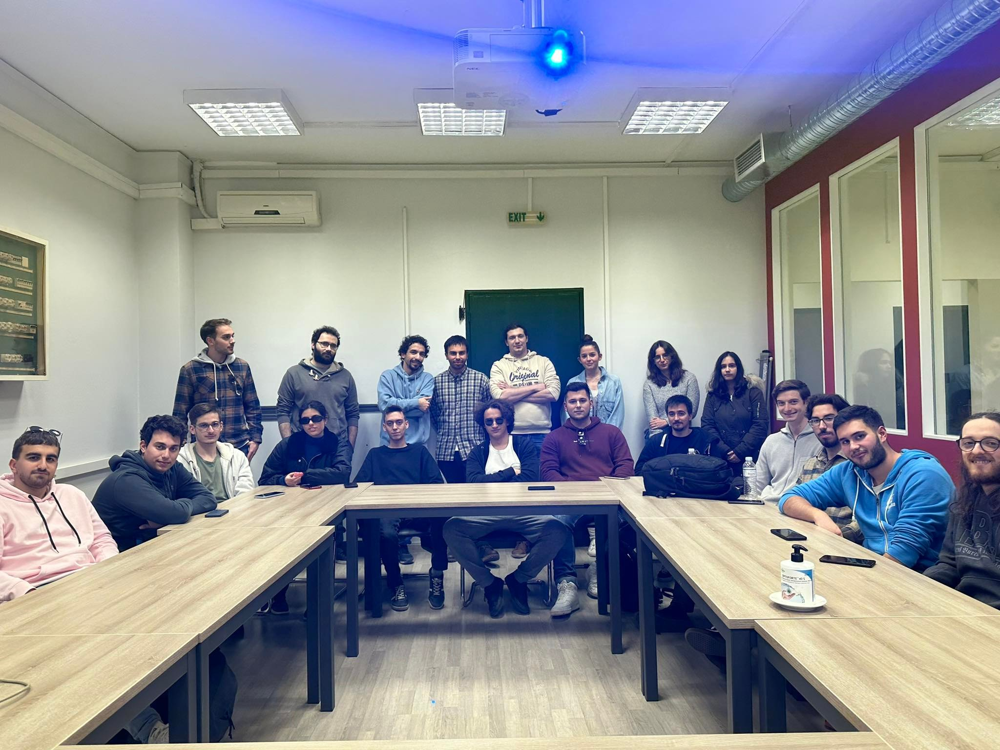

 

  

<h1>K08 - Δομές Δεδομένων Άρτιων ΑΜ </h1>
"Τίποτα περιττό σε αυτή τη ζωή.."

 

Σε αυτό το repo θα βρείτε υποστηρικτικό υλικό για τα εργαστήρια ρων δομών.

__Ιστοσελίδα μαθήματος:__ [https://cgi.di.uoa.gr/~k08/lab.html](https://cgi.di.uoa.gr/~k08/lab.html)

__Yπεύθυνος καθηγητής:__ Μανόλης Κουμπαράκης

## Περιεχόμενα

### `Lab 1`: Εισαγωγικό - C recap/Git/Unix

### `Lab 2`: Modules/Unit  tests/Makefiles & Linked-lists

### `Lab 3`: Valgrind

### `Lab 4`: Vectors

### `Lab 5`: Binary Search Trees

### ...

### `Lab 10`: Generic Data Structures

## Εργαστήρια 2023

Τα εργαστήρια γίνονται υπό την επίβλεψη των:
- Μίλτος Κυριακάκος   [miltos at di.uoa.gr]
- Σέργιος-Ανέστης Κεφαλίδης   [s.kefalidis at di.uoa.gr] - Εργαστήριο Παρασκευής
- Κωνσταντίνος Νικολέτος   [k.nikoletos at di.uoa.gr] - Εργαστήριο Τρίτης
- Κώστας Πλας   [kplas at di.uoa.gr] - Εργαστήριο Τετάρτης

*ΣΗΜΑΝΤΙΚΟ:* Όλες οι ερωτήσεις σχετικά με τα εργαστήρια πρέπει να απευθύνονται στους ανωτέρω.

## Βοηθοί Εργαστηρίων 2023

### Τρίτη 09:00-11:00

- Αντώνης Καλαντζής
- Αλέξανδρος Κώστας
- Κωνσταντίνος Αρκουλής

### Τρίτη 11:00-13:00

- Αναστάσιος Τριανταφύλλου
- Θεοδωρής Μάλλιος
- Γιώργος Νικολαίδης
- Νιόβη Κουμπαράκη 

### Τετάρτη 09:00-11:00

- Φαίδων Σεϊτανίδης
- Κωνσταντίνος Χούσος
- Oρφανίδης Δημήτριος

### Τετάρτη 09:00-11:00

- Νταής Παύλος
- Στέλλα Τζιούμα
- Γιώργος Σωφρονάς
- Ελευθέριος Στέτσικας

### Παρασκευή 13:00-15:00

- Βυρων-Γεωργιος Ανεμογιάννης 
- Γιώργος Βασιλακόπουλος
- Κωνσταντίνα Γρηγορίου 

### Παρασκευή 15:00-17:00

- Χαριτίνη Χαλακατέβα 
- Oρφανιδης Δημητριος
- Γιώργος Νικολαου
- Έλενα Φίλη

# THE team

