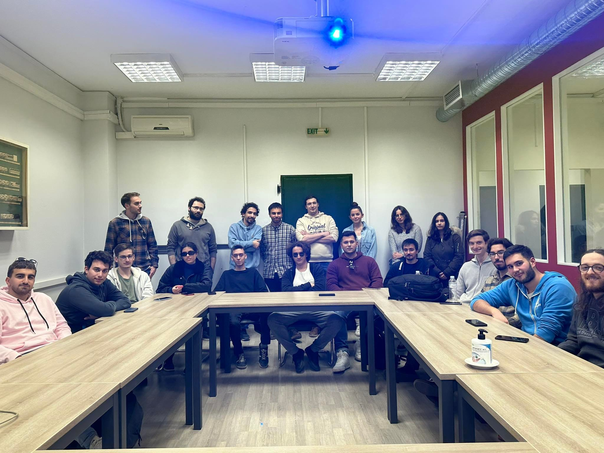

# K08 Labs

__Ιστοσελίδα εργαστηρίων μαθήματος:__ [https://cgi.di.uoa.gr/~k08/lab.html](https://cgi.di.uoa.gr/~k08/lab.html)

## Περιεχόμενα

### `Lab 1`: Εισαγωγικό - C recap/Git/Unix

### `Lab 2`: Modules/Unit  tests/Makefiles & Linked-lists

### `Lab 3`: Vectors

### `Lab 4`: Valgrind

### `Lab 5`: Binary Search Trees

### `Lab 6`: AVL Trees

### `Lab 7`: [to be anounced]

### `Lab 8`: Hashtables

### `Lab 9`: Probabilistic DS - Bloom Filter

### `Lab 10`: Generic Data Structures

## Εργαστήρια 2023

Τα εργαστήρια γίνονται υπό την επίβλεψη των:
- Μίλτος Κυριακάκος   [miltos at di.uoa.gr]
- Σέργιος-Ανέστης Κεφαλίδης   [s.kefalidis at di.uoa.gr] - Εργαστήριο Παρασκευής
- Κωνσταντίνος Νικολέτος   [k.nikoletos at di.uoa.gr] - Εργαστήριο Τρίτης
- Κώστας Πλας   [kplas at di.uoa.gr] - Εργαστήριο Τετάρτης

⁉️ Όλες οι ερωτήσεις σχετικά με τα εργαστήρια πρέπει να απευθύνονται στους ανωτέρω. Εάν είναι κάποια ερώτηση σχετική με το υλικό ενθαρρύνεται να την ανεβάζετε στο Piazza του μαθήματος στο directory `labs`. Διαφορετικά, για τεχνικά ζητήματα, καλό είναι να στέλνετε email στον υπεύθυνο του εργαστηρίου που είστε, με cc στο [miltos at di.uoa.gr].

## Βοηθοί Εργαστηρίων 2023

### Τρίτη 09:00-11:00

- Αντώνης Καλαντζής
- Αλέξανδρος Κώστας
- Κωνσταντίνος Αρκουλής

### Τρίτη 11:00-13:00

- Αναστάσιος Τριανταφύλλου
- Θεοδωρής Μάλλιος
- Γιώργος Νικολαίδης
- Νιόβη Κουμπαράκη 

### Τετάρτη 09:00-11:00

- Φαίδων Σεϊτανίδης
- Κωνσταντίνος Χούσος
- Oρφανίδης Δημήτριος

### Τετάρτη 11:00-13:00

- Νταής Παύλος
- Στέλλα Τζιούμα
- Γιώργος Σωφρονάς
- Ελευθέριος Στέτσικας

### Παρασκευή 13:00-15:00

- Βυρων-Γεωργιος Ανεμογιάννης 
- Γιώργος Βασιλακόπουλος
- Κωνσταντίνα Γρηγορίου 

### Παρασκευή 15:00-17:00

- Χαριτίνη Χαλακατέβα 
- Oρφανιδης Δημητριος
- Γιώργος Νικολαου
- Έλενα Φίλη

# THE team

